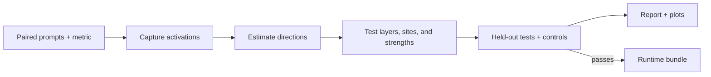

# Abliteration

**A local LLM abliteration workbench for model interpretability experiments and deployable runtime hooks.** Abliteration automates activation capture, layer and intervention searches, held-out checks, plots, and packaging for open-weight language models. You control the model, paired prompts, behavior metric, candidate layers, intervention site, token scope, and generation phase. The same workflow can study response length, formatting, refusal behavior, and other measurable contrasts for authorized research and red-team evaluations.

**New to abliteration?** Read [Understanding Abliteration: How I Learned to Read and Edit an Open-Weight LLM Without Fine-Tuning](https://www.hackingdream.net/2026/10/understanding-abliteration-how-i-learned-to-edit-an-open-weight-llm-without-finetuning.html). It explains activation directions, causal layer tests, and the Qwen experiments in accessible terms. Return here to run the tool.

## What the workbench does

| Capability | What you can control or inspect |
|---|---|
| **Define a behavior** | Supply paired positive and negative messages plus separate validation, test, and control prompts. Choose token count, word count, regex, JSON validity, exact/contains, or a local custom scorer. |
| **Find directions** | Capture actual transformer block activations and estimate a mean contrast or a declared low-rank subspace. Inspect held-out separation before treating a layer as a candidate. |
| **Test causal effects** | Sweep selected layers and strengths with additive steering, then test projection ablation at residual, attention-output, and MLP-output sites where the model adapter supports them. |
| **Control intervention scope** | Apply a hook to the last valid token or all valid tokens; run it during prefill, decode, or both. Test named multi-layer regions when a single layer is insufficient. |
| **Check alternative explanations** | Run no-op checks, random-direction controls, response-cap and repetition diagnostics, held-out prompts, control drift, and fixed-reference likelihood checks. |
| **Automate and resume** | Use a bounded planner with fast, normal, or rigorous profiles. Stop and resume from cached generation batches; fork a run to change configuration without overwriting its evidence. |
| **See the evidence** | Get stage artifacts, CSV/JSON measurements, local HTML/Markdown reports, and plots. The report records why the planner continued, stopped, or requested review. |
| **Deploy a validated hook** | Package unchanged model files, direction tensors, a runtime runner, and an integrity manifest. The bundle command requires a passing held-out result and exact replay of saved outputs. |
| **Explore weight edits explicitly** | Draft an export plan and project supported floating writer weights into a copied checkpoint, followed by an equivalence check. A runtime hook and a static weight edit have different semantics. |
| **Reuse existing work** | Audit the original 05–09 experiment artifacts and import actual legacy direction vectors with provenance warnings. Compare runs and benchmark throughput on your own hardware. |

The pipeline is **file-driven and local**. It uses no gradient training, application server, hosted judge, telemetry, or paid API. Downloading a model from its provider may still require network access and acceptance of its license.



A strong direction score identifies a representation contrast. Behavioral tests and independent controls decide whether an intervention is useful. The automatic route may stop with `needs_data` or `needs_review`; it does not invent a winner.

## Measured Qwen result

A validated Qwen2.5-1.5B-Instruct **verbosity** hook uses residual layers **13, 16, 18, 20, and 22 together**. Eight held-out prompts averaged **207.4 tokens before** and **119.5 after** the hook, a **42.4% shorter mean**. Four control prompts showed zero absolute drift on the selected token-count metric. One original response reached the 384-token cap. The packaged runtime bundle replayed all **12/12** saved test and control outputs exactly.


These numbers support a response-length change on this small test set. They do not establish factual accuracy or the same effect on other models. See the [machine-readable benchmark data](validation/benchmark-data.json), [validation record](validation/VALIDATION.md), and [methodology](docs/METHODOLOGY.md). Regenerate the figure with `python3 tools/plot_readme_benchmarks.py`; completed runs also generate their own plots.

## Quick start

Use Python 3.10+ and CUDA-enabled PyTorch for the Qwen example. The repository contains code and example data, not model weights.

```bash
conda activate alter
git clone https://github.com/Bhanunamikaze/Abliteration-Workbench.git
cd Abliteration-Workbench
python3 -m pip install -e '.[hf,plots,test]'
abliteration doctor
abliteration validate --config examples/verbosity.json
abliteration init --config examples/verbosity.json --run runs/qwen-verbosity
abliteration plan --run runs/qwen-verbosity
abliteration run --run runs/qwen-verbosity
abliteration report --run runs/qwen-verbosity
abliteration plot --run runs/qwen-verbosity
```

Open `runs/qwen-verbosity/stages/12_report/report.html` to inspect the result. Stop with Ctrl+C and repeat `abliteration run --run runs/qwen-verbosity` to resume. Run `abliteration status --run runs/qwen-verbosity` to see completed stages and budgets.

## Bring your own behavior and model

A dataset is JSON or JSONL with disjoint `train`, `validation`, `test`, and `control` groups. Training and validation rows pair contrasting instructions; `neutral` prompts measure the unprompted behavior. “Training” in this workflow means estimating an activation direction from examples. The [data guide](docs/DATA.md) includes the schema and validation rules.

A config selects the scorer and search. For example, the included verbosity task uses a token-count metric with a decrease goal. You can also set `search.layers`, steering and ablation strengths, `generation.scope`, `generation.phase`, a model snapshot, output caps, and generation/time budgets. Start a new run or use `abliteration fork` when changing those settings so prior results remain attributable to their original config.

Built-in runtime adapters cover supported text-decoder layouts in **Qwen2/Qwen2.5, Llama, Mistral, GPT-2, GPT-NeoX, and some MoE families**. Model size still determines VRAM needs. Fused expert weights, multimodal models, encoder-decoder models, state-space models, and TPU execution need additional support. See the [model support matrix](docs/MODELS.md) for site-by-site details. Adapter support does not guarantee a behavioral result.

## Package a passing result

After reviewing a run's held-out and control outputs, package a **passing** intervention:

```bash
abliteration bundle --run runs/qwen-verbosity --out checkpoints/qwen-verbosity-runtime
python3 checkpoints/qwen-verbosity-runtime/run_bundle.py \
  --prompt 'Explain how a solar panel works.'
```

The bundle copies the original model weights and applies the tested hook during generation. Loading the copied `model/` directory alone gives the original behavior. A standalone bundle includes its runner, directions, manifest, and dependency list; the repository excludes large checkpoints and run outputs. For an exploratory static checkpoint edit, use `export-plan`, `export`, and `evaluate-checkpoint` only after reading the [export limits](docs/METHODOLOGY.md#10-export).

## Documentation and project links

- [Full usage guide in the wiki](https://github.com/Bhanunamikaze/Abliteration-Workbench/wiki/Usage-Guide) · [versioned repository copy](docs/USAGE.md)
- [CLI commands and configuration](docs/CLI.md) · [dataset format](docs/DATA.md) · [model support](docs/MODELS.md)
- [Contributing](CONTRIBUTING.md) · [support](SUPPORT.md) · [security reporting](SECURITY.md)

Workbench code is [MIT licensed](LICENSE). Model checkpoints and third-party benchmarks retain their own terms.
