# AblationLab | verbosity

Model: `toy:dense`
Run: `dense`

**Next decision:** report
**Reason:** Experiments complete; report measured limits

Automatic research stages do not edit model parameters. A separate explicit export command writes a copied checkpoint.
Results describe this dataset, metric, precision, token scope, and model revision. They are not universal layer labels.

## Stage record

## Measurement plots

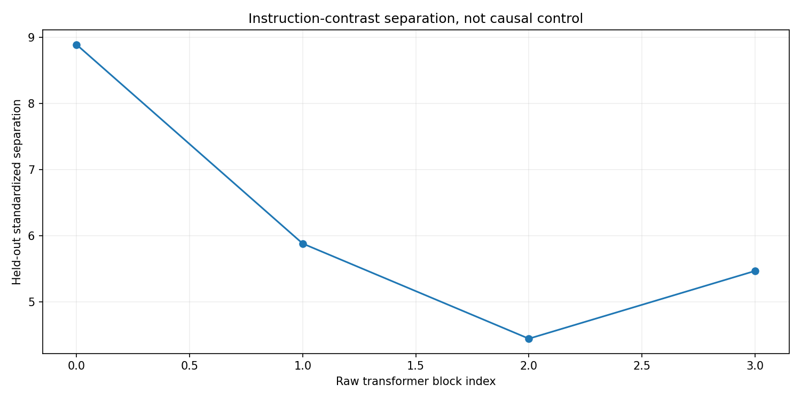
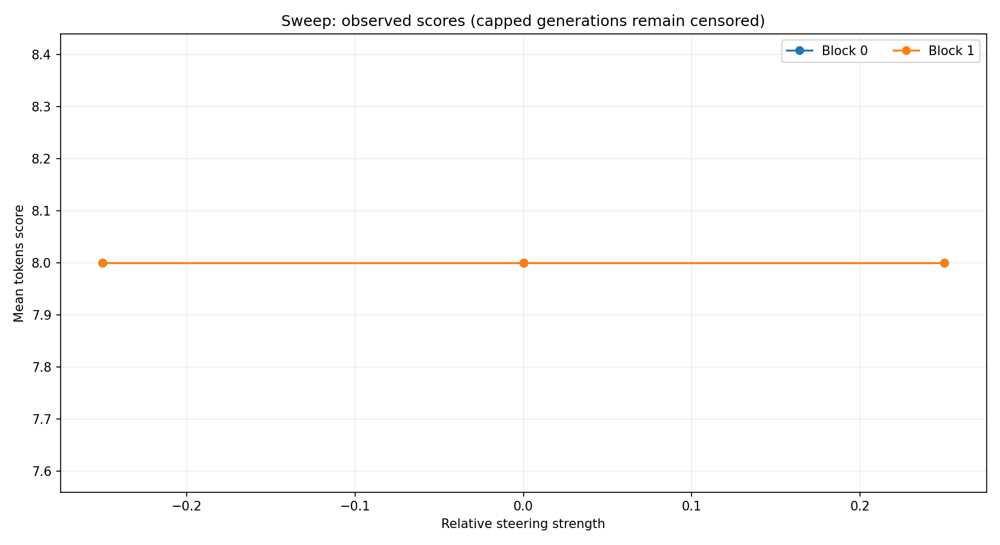
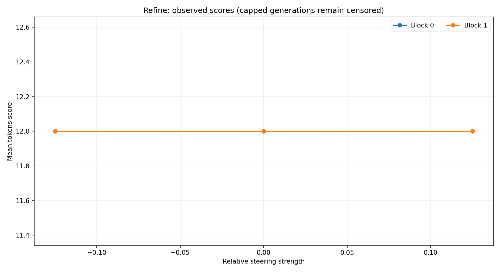
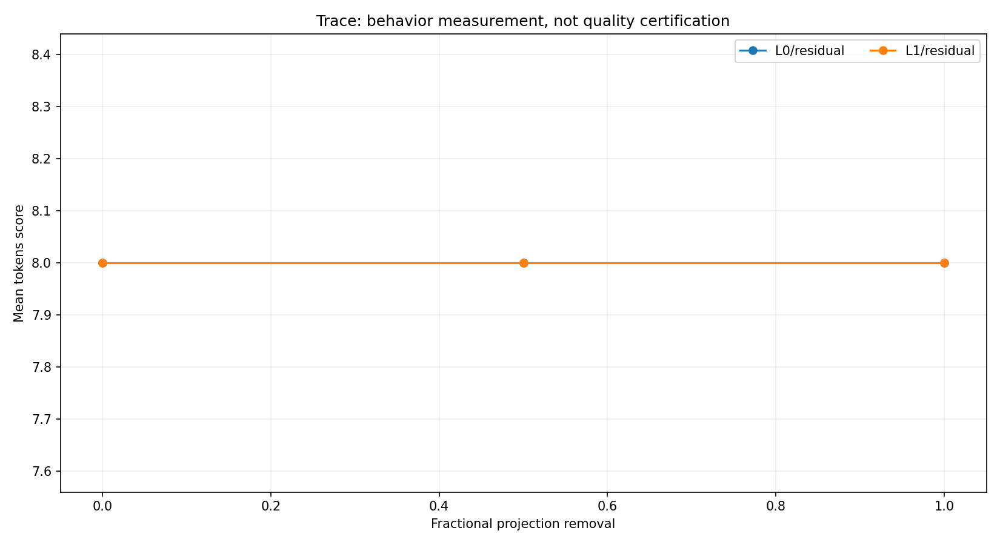
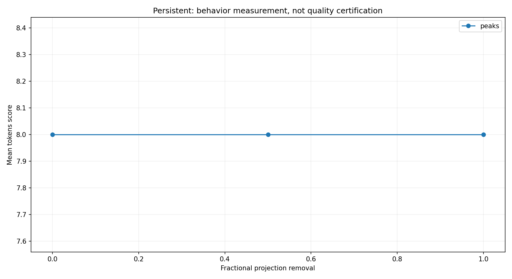
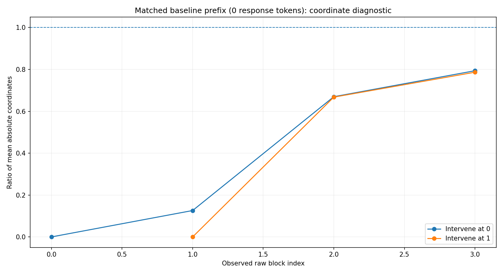
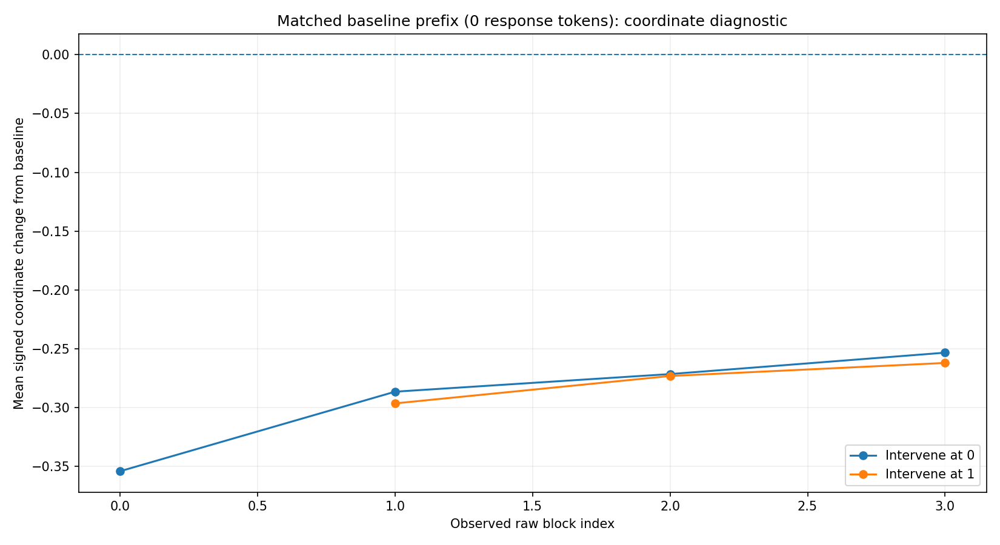
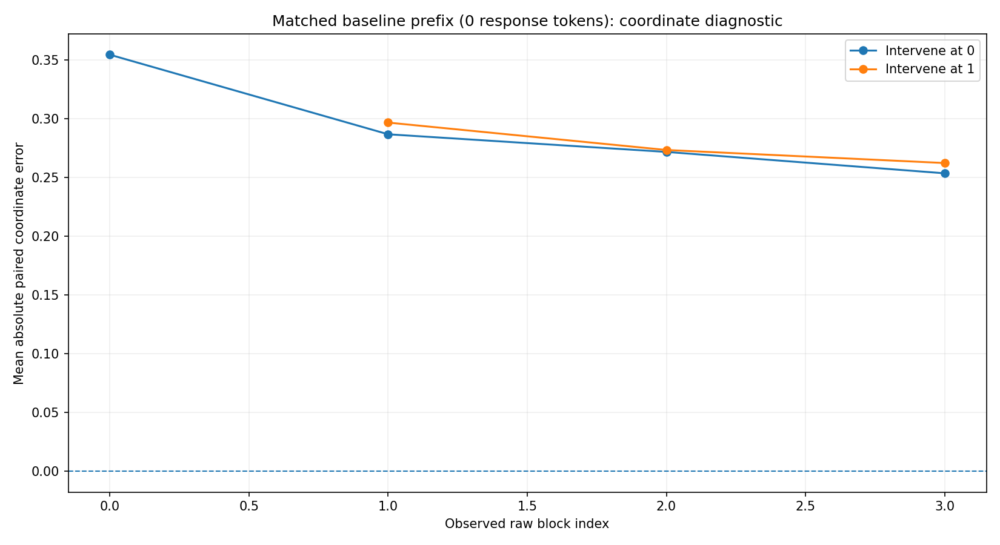
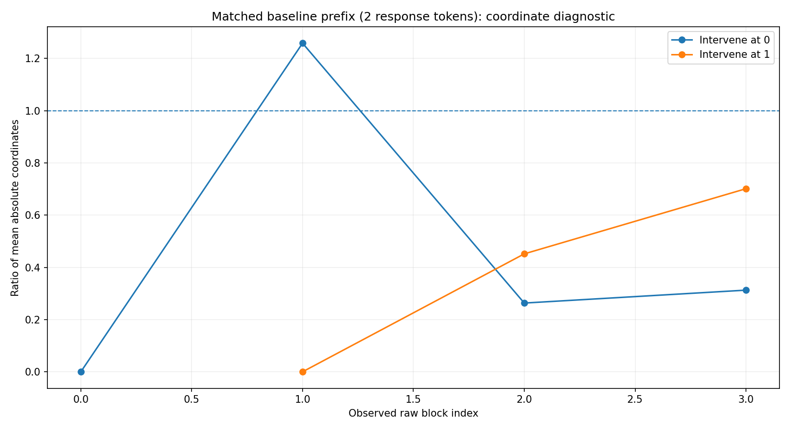
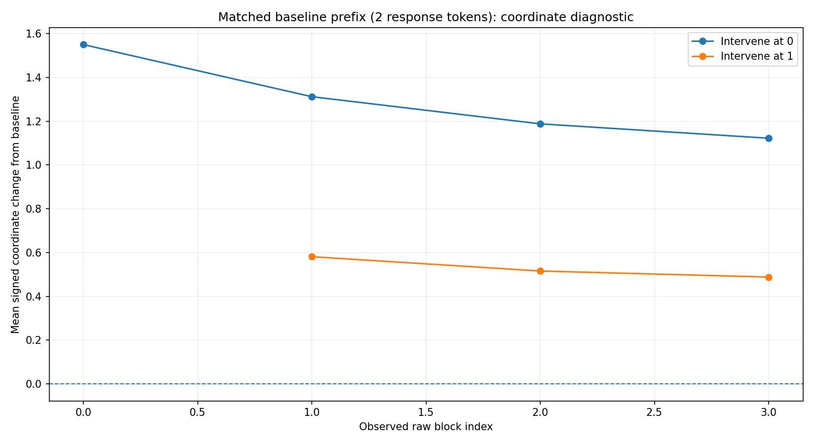
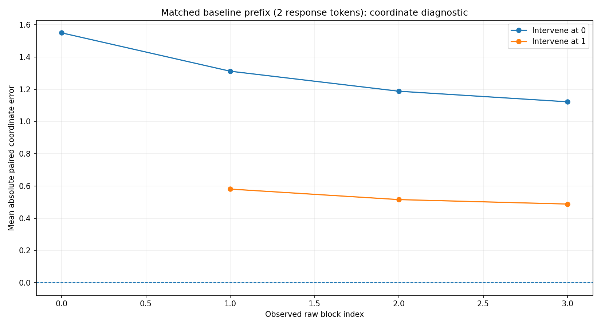

### inspect
What architecture and output sites were actually observed? Unsupported sites are not guessed.

```json
{
  "capabilities": {
    "device": "cpu",
    "dtype": "torch.float32",
    "expert_inventory": [],
    "hidden_size": 24,
    "limitations": [
      "MoE support refers to block/aggregate-mixture output, not arbitrary routed/fused expert surgery",
      "Names and output shapes do not prove a component's natural behavioral role",
      "last-block hooks are before final model norm; directions use that same site"
    ],
    "model_id": "toy:dense",
    "moe_layers": [],
    "num_layers": 4,
    "parameter_bytes": 144384,
    "parameter_count": 36096,
    "resolved_revision": null,
    "sites": [
      {
        "exportable_linear": false,
        "kind": "residual",
        "layer": 0,
        "name": "residual",
        "path": "model.layers.0",
        "runtime_validated": true
      },
      {
        "exportable_linear": true,
        "kind": "writer",
        "layer": 0,
        "name": "attention",
        "path": "model.layers.0.self_attn.o_proj",
        "runtime_validated": true
      },
      {
        "exportable_linear": true,
        "kind": "writer",
        "layer": 0,
        "name": "mlp",
        "path": "model.layers.0.mlp.down_proj",
        "runtime_validated": true
      },
      {
        "exportable_linear": false,
        "kind": "residual",
        "layer": 1,
        "name": "residual",
        "path": "model.layers.1",
        "runtime_validated": true
      },
      {
        "exportable_linear": true,
        "kind": "writer",
        "layer": 1,
        "name": "attention",
        "path": "model.layers.1.self_attn.o_proj",
        "runtime_validated": true
      },
      {
        "exportable_linear": true,
        "kind": "writer",
        "layer": 1,
        "name": "mlp",
        "path": "model.layers.1.mlp.down_proj",
        "runtime_validated": true
      },
      {
        "exportable_linear": false,
        "kind": "residual",
        "layer": 2,
        "name": "residual",
        "path": "model.layers.2",
        "runtime_validated": true
      },
      {
        "exportable_linear": true,
        "kind": "writer",
        "layer": 2,
        "name": "attention",
        "path": "model.layers.2.self_attn.o_proj",
        "runtime_validated": true
      },
      {
        "exportable_linear": true,
        "kind": "writer",
        "layer": 2,
        "name": "mlp",
        "path": "model.layers.2.mlp.down_proj",
        "runtime_validated": true
      },
      {
        "exportable_linear": false,
        "kind": "residual",
        "layer": 3,
        "name": "residual",
        "path": "model.layers.3",
        "runtime_validated": true
      },
      {
        "exportable_linear": true,
        "kind": "writer",
        "layer": 3,
        "name": "attention",
        "path": "model.layers.3.self_attn.o_proj",
        "runtime_validated": true
      },
      {
        "exportable_linear": true,
        "kind": "writer",
        "layer": 3,
        "name": "mlp",
        "path": "model.layers.3.mlp.down_proj",
        "runtime_validated": true
      }
    ],
    "stack_path": "model.layers",
    "toy_fixture": true
  },
  "model_identity": "9091b86c5e10090a2d54cf4c2cbae4752fd7d86eef98951aa88db908a7215b2d"
}
```

### baseline
How does the untouched model respond? The positive/negative instructions may not produce the behavior you expected.

```json
{
  "cap_rate": 1.0,
  "mean_score": 8.0,
  "no_op_exact": true,
  "note": "Instruction labels do not prove observed behavior; inspect contrast_outputs.json",
  "positive_minus_negative_score": 0.0
}
```

### capture
Capture raw block outputs on paired training/validation examples, before final model normalization.

```json
{
  "capture_site": "raw_block_output",
  "ids": {
    "train": [
      "train-0",
      "train-1",
      "train-2",
      "train-3"
    ],
    "validation": [
      "validation-0",
      "validation-1",
      "validation-2",
      "validation-3"
    ]
  },
  "model_identity": "9091b86c5e10090a2d54cf4c2cbae4752fd7d86eef98951aa88db908a7215b2d",
  "position": "last_prompt_token",
  "shapes": {
    "train_negative": [
      4,
      4,
      24
    ],
    "train_positive": [
      4,
      4,
      24
    ],
    "validation_negative": [
      4,
      4,
      24
    ],
    "validation_positive": [
      4,
      4,
      24
    ]
  }
}
```

### directions
Estimate a direction or subspace and check held-out separation. This is not proof of causality.

```json
{
  "calibrated": true,
  "eligible_layers": [
    0,
    1,
    2,
    3
  ],
  "metrics": [
    {
      "layer": 0,
      "midpoint_accuracy": 0.875,
      "negative_coordinate": 0.06532520055770874,
      "paired_positive_fraction": 1.0,
      "pooled_std": 0.03322494029998779,
      "positive_coordinate": 0.3574916422367096,
      "standardized_separation": 8.893516940486741,
      "train_gap": 0.292166531085968,
      "validation_margin": 0.29548656940460205
    },
    {
      "layer": 1,
      "midpoint_accuracy": 0.875,
      "negative_coordinate": 0.05220809578895569,
      "paired_positive_fraction": 1.0,
      "pooled_std": 0.05066943168640137,
      "positive_coordinate": 0.34719526767730713,
      "standardized_separation": 5.8806446831637045,
      "train_gap": 0.29498717188835144,
      "validation_margin": 0.29796892404556274
    },
    {
      "layer": 2,
      "midpoint_accuracy": 1.0,
      "negative_coordinate": 0.6021502017974854,
      "paired_positive_fraction": 1.0,
      "pooled_std": 0.07892688363790512,
      "positive_coordinate": 0.953289270401001,
      "standardized_separation": 4.440839176365406,
      "train_gap": 0.35113903880119324,
      "validation_margin": 0.3505015969276428
    },
    {
      "layer": 3,
      "midpoint_accuracy": 1.0,
      "negative_coordinate": 0.9277867674827576,
      "paired_positive_fraction": 1.0,
      "pooled_std": 0.08354421705007553,
      "positive_coordinate": 1.3847527503967285,
      "standardized_separation": 5.466450312870242,
      "train_gap": 0.4569658935070038,
      "validation_margin": 0.45669031143188477
    }
  ],
  "note": "Held-out instruction-contrast separation; not automatic causal proof"
}
```

### sweep
Intervene at individual layers and compare behavioral scores. Random directions test generic disruption.

```json
{
  "candidates": [],
  "cap_heavy": false,
  "exploratory_candidates": [
    {
      "cap_rate": 1.0,
      "effect": 0.0,
      "effect_fraction": 0.0,
      "eligible": false,
      "layer": 0,
      "max_new_tokens": 8,
      "orientation": 1,
      "random_control_max_effect": 0.0,
      "ranking_score": 0.0,
      "repeat_increase": 0.0,
      "signed_effect": 0.0,
      "specificity_pass": false,
      "strength_score_correlation": 0.0,
      "win_rate": 0.0
    },
    {
      "cap_rate": 1.0,
      "effect": 0.0,
      "effect_fraction": 0.0,
      "eligible": false,
      "layer": 1,
      "max_new_tokens": 8,
      "orientation": 1,
      "random_control_max_effect": 0.0,
      "ranking_score": 0.0,
      "repeat_increase": 0.0,
      "signed_effect": 0.0,
      "specificity_pass": false,
      "strength_score_correlation": 0.0,
      "win_rate": 0.0
    }
  ],
  "max_new_tokens": 8,
  "note": "Candidate thresholds are configurable heuristics; test split not used here",
  "strengths": [
    -0.25,
    0.25
  ],
  "summary": [
    {
      "cap_rate": 1.0,
      "effect": 0.0,
      "effect_fraction": 0.0,
      "eligible": false,
      "layer": 0,
      "max_new_tokens": 8,
      "orientation": 1,
      "random_control_max_effect": 0.0,
      "ranking_score": 0.0,
      "repeat_increase": 0.0,
      "signed_effect": 0.0,
      "specificity_pass": false,
      "strength_score_correlation": 0.0,
      "win_rate": 0.0
    },
    {
      "cap_rate": 1.0,
      "effect": 0.0,
      "effect_fraction": 0.0,
      "eligible": false,
      "layer": 1,
      "max_new_tokens": 8,
      "orientation": 1,
      "random_control_max_effect": 0.0,
      "ranking_score": 0.0,
      "repeat_increase": 0.0,
      "signed_effect": 0.0,
      "specificity_pass": false,
      "strength_score_correlation": 0.0,
      "win_rate": 0.0
    }
  ]
}
```

### refine
One bounded confirmation with gentler interventions and a higher token ceiling.

```json
{
  "candidates": [],
  "cap_heavy": false,
  "exploratory_candidates": [
    {
      "cap_rate": 1.0,
      "effect": 0.0,
      "effect_fraction": 0.0,
      "eligible": false,
      "layer": 0,
      "max_new_tokens": 12,
      "orientation": 1,
      "random_control_max_effect": 0.0,
      "ranking_score": 0.0,
      "repeat_increase": 0.0,
      "signed_effect": 0.0,
      "specificity_pass": false,
      "strength_score_correlation": 0.0,
      "win_rate": 0.0
    },
    {
      "cap_rate": 1.0,
      "effect": 0.0,
      "effect_fraction": 0.0,
      "eligible": false,
      "layer": 1,
      "max_new_tokens": 12,
      "orientation": 1,
      "random_control_max_effect": 0.0,
      "ranking_score": 0.0,
      "repeat_increase": 0.0,
      "signed_effect": 0.0,
      "specificity_pass": false,
      "strength_score_correlation": 0.0,
      "win_rate": 0.0
    }
  ],
  "max_new_tokens": 12,
  "note": "Candidate thresholds are configurable heuristics; test split not used here",
  "strengths": [
    -0.125,
    0.125
  ],
  "summary": [
    {
      "cap_rate": 1.0,
      "effect": 0.0,
      "effect_fraction": 0.0,
      "eligible": false,
      "layer": 0,
      "max_new_tokens": 12,
      "orientation": 1,
      "random_control_max_effect": 0.0,
      "ranking_score": 0.0,
      "repeat_increase": 0.0,
      "signed_effect": 0.0,
      "specificity_pass": false,
      "strength_score_correlation": 0.0,
      "win_rate": 0.0
    },
    {
      "cap_rate": 1.0,
      "effect": 0.0,
      "effect_fraction": 0.0,
      "eligible": false,
      "layer": 1,
      "max_new_tokens": 12,
      "orientation": 1,
      "random_control_max_effect": 0.0,
      "ranking_score": 0.0,
      "repeat_increase": 0.0,
      "signed_effect": 0.0,
      "specificity_pass": false,
      "strength_score_correlation": 0.0,
      "win_rate": 0.0
    }
  ]
}
```

### writers
Compare places to inject an activation. This does not identify which matrix naturally owns the behavior.

```json
{
  "note": "For sequential pre-norm blocks, MLP-output addition and block-output addition can be algebraically equivalent; rounding is not natural attribution",
  "selected_sites": [],
  "summary": [
    {
      "cap_rate": 1.0,
      "effect": 0.0,
      "kind": "residual",
      "layer": 0,
      "note": "Intervention-site sensitivity, NOT natural component responsibility",
      "path": "model.layers.0",
      "site": "residual",
      "win_rate": 0.0
    },
    {
      "cap_rate": 1.0,
      "effect": 0.0,
      "kind": "writer",
      "layer": 0,
      "note": "Intervention-site sensitivity, NOT natural component responsibility",
      "path": "model.layers.0.self_attn.o_proj",
      "site": "attention",
      "win_rate": 0.0
    },
    {
      "cap_rate": 1.0,
      "effect": 0.0,
      "kind": "writer",
      "layer": 0,
      "note": "Intervention-site sensitivity, NOT natural component responsibility",
      "path": "model.layers.0.mlp.down_proj",
      "site": "mlp",
      "win_rate": 0.0
    },
    {
      "cap_rate": 1.0,
      "effect": 0.0,
      "kind": "composite",
      "layer": 0,
      "note": "Intervention-site sensitivity, NOT natural component responsibility",
      "path": "split attention + MLP output injection",
      "site": "both",
      "win_rate": 0.0
    },
    {
      "cap_rate": 1.0,
      "effect": 0.0,
      "kind": "residual",
      "layer": 1,
      "note": "Intervention-site sensitivity, NOT natural component responsibility",
      "path": "model.layers.1",
      "site": "residual",
      "win_rate": 0.0
    },
    {
      "cap_rate": 1.0,
      "effect": 0.0,
      "kind": "writer",
      "layer": 1,
      "note": "Intervention-site sensitivity, NOT natural component responsibility",
      "path": "model.layers.1.self_attn.o_proj",
      "site": "attention",
      "win_rate": 0.0
    },
    {
      "cap_rate": 1.0,
      "effect": 0.0,
      "kind": "writer",
      "layer": 1,
      "note": "Intervention-site sensitivity, NOT natural component responsibility",
      "path": "model.layers.1.mlp.down_proj",
      "site": "mlp",
      "win_rate": 0.0
    },
    {
      "cap_rate": 1.0,
      "effect": 0.0,
      "kind": "composite",
      "layer": 1,
      "note": "Intervention-site sensitivity, NOT natural component responsibility",
      "path": "split attention + MLP output injection",
      "site": "both",
      "win_rate": 0.0
    }
  ]
}
```

### ablate
Remove an existing component at writer outputs. Zero and negative-class coordinates are not equivalent.

```json
{
  "all_tested": 0,
  "note": "Zero removes a geometric component, not necessarily positive behavior; negative-centroid reference is separately declared",
  "promising": [],
  "summary": []
}
```

### trace
Compare raw residual ablation with fixed-prefix, signed-coordinate measurements. Coordinate return alone is not reconstruction.

```json
{
  "all_tested": 4,
  "note": "Zero removes a geometric component, not necessarily positive behavior; negative-centroid reference is separately declared",
  "projection_summary": [
    {
      "eligible_fraction": 1.0,
      "mean_abs_paired_error": 0.354189557954669,
      "mean_baseline_abs": 0.35418950766324997,
      "mean_baseline_signed": 0.35418950766324997,
      "mean_changed_abs": 5.4016709327697754e-08,
      "mean_changed_signed": -5.029141902923584e-08,
      "mean_signed_delta": -0.354189557954669,
      "median_individual_abs_ratio_eligible": 1.6489029829264195e-07,
      "observed_layer": 0,
      "prefix_tokens": 0,
      "ratio_of_mean_abs": 1.5250793193754008e-07,
      "rmse_paired": 0.35682762706378585,
      "sign_agreement_eligible": 0.25,
      "source_layer": 0
    },
    {
      "eligible_fraction": 1.0,
      "mean_abs_paired_error": 0.2865406647324562,
      "mean_baseline_abs": 0.2964877560734749,
      "mean_baseline_signed": 0.2964877560734749,
      "mean_changed_abs": 0.037370216101408005,
      "mean_changed_signed": 0.009947091341018677,
      "mean_signed_delta": -0.2865406647324562,
      "median_individual_abs_ratio_eligible": 0.12107261881950501,
      "observed_layer": 1,
      "prefix_tokens": 0,
      "ratio_of_mean_abs": 0.12604303326491165,
      "rmse_paired": 0.28862031478473144,
      "sign_agreement_eligible": 0.5,
      "source_layer": 0
    },
    {
      "eligible_fraction": 1.0,
      "mean_abs_paired_error": 0.2715517058968544,
      "mean_baseline_abs": 0.8217840939760208,
      "mean_baseline_signed": 0.8217840939760208,
      "mean_changed_abs": 0.5502323880791664,
      "mean_changed_signed": 0.5502323880791664,
      "mean_signed_delta": -0.2715517058968544,
      "median_individual_abs_ratio_eligible": 0.6587850990461752,
      "observed_layer": 2,
      "prefix_tokens": 0,
      "ratio_of_mean_abs": 0.669558333037317,
      "rmse_paired": 0.27341093904250713,
      "sign_agreement_eligible": 1.0,
      "source_layer": 0
    },
    {
      "eligible_fraction": 1.0,
      "mean_abs_paired_error": 0.25336509943008423,
      "mean_baseline_abs": 1.2279248237609863,
      "mean_baseline_signed": 1.2279248237609863,
      "mean_changed_abs": 0.9745597243309021,
      "mean_changed_signed": 0.9745597243309021,
      "mean_signed_delta": -0.25336509943008423,
      "median_individual_abs_ratio_eligible": 0.7925374558431237,
      "observed_layer": 3,
      "prefix_tokens": 0,
      "ratio_of_mean_abs": 0.7936639975613023,
      "rmse_paired": 0.255113012873873,
      "sign_agreement_eligible": 1.0,
      "source_layer": 0
    },
    {
      "eligible_fraction": 1.0,
      "mean_abs_paired_error": 1.549939738586545,
      "mean_baseline_abs": 1.5499396920204163,
      "mean_baseline_signed": -1.5499396920204163,
      "mean_changed_abs": 5.4016709327697754e-08,
      "mean_changed_signed": 4.6566128730773926e-08,
      "mean_signed_delta": 1.549939738586545,
      "median_individual_abs_ratio_eligible": 2.5133608378277843e-08,
      "observed_layer": 0,
      "prefix_tokens": 2,
      "ratio_of_mean_abs": 3.4850845878580305e-08,
      "rmse_paired": 1.5508885314703547,
      "sign_agreement_eligible": 0.25,
      "source_layer": 0
    },
    {
      "eligible_fraction": 1.0,
      "mean_abs_paired_error": 1.311953142285347,
      "mean_baseline_abs": 0.580970510840416,
      "mean_baseline_signed": -0.580970510840416,
      "mean_changed_abs": 0.730982631444931,
      "mean_changed_signed": 0.730982631444931,
      "mean_signed_delta": 1.311953142285347,
      "median_individual_abs_ratio_eligible": 1.2075418505227664,
      "observed_layer": 1,
      "prefix_tokens": 2,
      "ratio_of_mean_abs": 1.2582095266548239,
      "rmse_paired": 1.3128078939120111,
      "sign_agreement_eligible": 0.0,
      "source_layer": 0
    },
    {
      "eligible_fraction": 1.0,
      "mean_abs_paired_error": 1.1878543496131897,
      "mean_baseline_abs": 0.9403439164161682,
      "mean_baseline_signed": -0.9403439164161682,
      "mean_changed_abs": 0.24751043319702148,
      "mean_changed_signed": 0.24751043319702148,
      "mean_signed_delta": 1.1878543496131897,
      "median_individual_abs_ratio_eligible": 0.27409038894789944,
      "observed_layer": 2,
      "prefix_tokens": 2,
      "ratio_of_mean_abs": 0.2632126702540188,
      "rmse_paired": 1.1887353093960422,
      "sign_agreement_eligible": 0.0,
      "source_layer": 0
    },
    {
      "eligible_fraction": 1.0,
      "mean_abs_paired_error": 1.1222312450408936,
      "mean_baseline_abs": 1.6327048242092133,
      "mean_baseline_signed": -1.6327048242092133,
      "mean_changed_abs": 0.5104735791683197,
      "mean_changed_signed": -0.5104735791683197,
      "mean_signed_delta": 1.1222312450408936,
      "median_individual_abs_ratio_eligible": 0.3301849238757695,
      "observed_layer": 3,
      "prefix_tokens": 2,
      "ratio_of_mean_abs": 0.31265515456265236,
      "rmse_paired": 1.1230664164529933,
      "sign_agreement_eligible": 1.0,
      "source_layer": 0
    },
    {
      "eligible_fraction": 1.0,
      "mean_abs_paired_error": 0.29648772813379765,
      "mean_baseline_abs": 0.2964877560734749,
      "mean_baseline_signed": 0.2964877560734749,
      "mean_changed_abs": 5.4016709327697754e-08,
      "mean_changed_signed": 2.7939677238464355e-08,
      "mean_signed_delta": -0.29648772813379765,
      "median_individual_abs_ratio_eligible": 1.2792761403872442e-07,
      "observed_layer": 1,
      "prefix_tokens": 0,
      "ratio_of_mean_abs": 1.821886679000379e-07,
      "rmse_paired": 0.3037944744403324,
      "sign_agreement_eligible": 0.5,
      "source_layer": 1
    },
    {
      "eligible_fraction": 1.0,
      "mean_abs_paired_error": 0.27319149672985077,
      "mean_baseline_abs": 0.8217840939760208,
      "mean_baseline_signed": 0.8217840939760208,
      "mean_changed_abs": 0.54859259724617,
      "mean_changed_signed": 0.54859259724617,
      "mean_signed_delta": -0.27319149672985077,
      "median_individual_abs_ratio_eligible": 0.6816050456868656,
      "observed_layer": 2,
      "prefix_tokens": 0,
      "ratio_of_mean_abs": 0.6675629295669693,
      "rmse_paired": 0.27984583337506747,
      "sign_agreement_eligible": 1.0,
      "source_layer": 1
    },
    {
      "eligible_fraction": 1.0,
      "mean_abs_paired_error": 0.2621025890111923,
      "mean_baseline_abs": 1.2279248237609863,
      "mean_baseline_signed": 1.2279248237609863,
      "mean_changed_abs": 0.965822234749794,
      "mean_changed_signed": 0.965822234749794,
      "mean_signed_delta": -0.2621025890111923,
      "median_individual_abs_ratio_eligible": 0.8008310171425987,
      "observed_layer": 3,
      "prefix_tokens": 0,
      "ratio_of_mean_abs": 0.7865483424234363,
      "rmse_paired": 0.26841680200231055,
      "sign_agreement_eligible": 1.0,
      "source_layer": 1
    },
    {
      "eligible_fraction": 1.0,
      "mean_abs_paired_error": 0.5809704139828682,
      "mean_baseline_abs": 0.580970510840416,
      "mean_baseline_signed": -0.580970510840416,
      "mean_changed_abs": 9.685754776000977e-08,
      "mean_changed_signed": -9.685754776000977e-08,
      "mean_signed_delta": 0.5809704139828682,
      "median_individual_abs_ratio_eligible": 1.5802809303078045e-07,
      "observed_layer": 1,
      "prefix_tokens": 2,
      "ratio_of_mean_abs": 1.6671680567727664e-07,
      "rmse_paired": 0.5854056899736743,
      "sign_agreement_eligible": 1.0,
      "source_layer": 1
    },
    {
      "eligible_fraction": 1.0,
      "mean_abs_paired_error": 0.5157165452837944,
      "mean_baseline_abs": 0.9403439164161682,
      "mean_baseline_signed": -0.9403439164161682,
      "mean_changed_abs": 0.4246273711323738,
      "mean_changed_signed": -0.4246273711323738,
      "mean_signed_delta": 0.5157165452837944,
      "median_individual_abs_ratio_eligible": 0.45107262748863675,
      "observed_layer": 2,
      "prefix_tokens": 2,
      "ratio_of_mean_abs": 0.45156603208612284,
      "rmse_paired": 0.519722370652962,
      "sign_agreement_eligible": 1.0,
      "source_layer": 1
    },
    {
      "eligible_fraction": 1.0,
      "mean_abs_paired_error": 0.4880673587322235,
      "mean_baseline_abs": 1.6327048242092133,
      "mean_baseline_signed": -1.6327048242092133,
      "mean_changed_abs": 1.1446374654769897,
      "mean_changed_signed": -1.1446374654769897,
      "mean_signed_delta": 0.4880673587322235,
      "median_individual_abs_ratio_eligible": 0.6889928652689747,
      "observed_layer": 3,
      "prefix_tokens": 2,
      "ratio_of_mean_abs": 0.7010682203572132,
      "rmse_paired": 0.4918737097402098,
      "sign_agreement_eligible": 1.0,
      "source_layer": 1
    }
  ],
  "promising": [],
  "summary": [
    {
      "baseline_cap_rate": 1.0,
      "cap_rate": 1.0,
      "ci95_high": 0.0,
      "ci95_low": 0.0,
      "gain_fraction_of_baseline_mean": 0.0,
      "intervention": {
        "control_seed": null,
        "layers": [
          0
        ],
        "operation": "ablate",
        "phase": "both",
        "reference": "zero",
        "scope": "last",
        "site": "residual",
        "strength": 0.5
      },
      "label": "L0/residual",
      "mean_baseline": 8.0,
      "mean_gain": 0.0,
      "mean_intervention": 8.0,
      "mean_per_example_fraction": 0.0,
      "median_gain": 0.0,
      "n": 4,
      "provisional_pass": false,
      "random_control_max_gain_fraction": 0.0,
      "repeat_increase": 0.0,
      "required_term_change": null,
      "tie_rate": 1.0,
      "uncensored_pair_fraction": 0.0,
      "win_rate": 0.0
    },
    {
      "baseline_cap_rate": 1.0,
      "cap_rate": 1.0,
      "ci95_high": 0.0,
      "ci95_low": 0.0,
      "gain_fraction_of_baseline_mean": 0.0,
      "intervention": {
        "control_seed": null,
        "layers": [
          0
        ],
        "operation": "ablate",
        "phase": "both",
        "reference": "zero",
        "scope": "last",
        "site": "residual",
        "strength": 1.0
      },
      "label": "L0/residual",
      "mean_baseline": 8.0,
      "mean_gain": 0.0,
      "mean_intervention": 8.0,
      "mean_per_example_fraction": 0.0,
      "median_gain": 0.0,
      "n": 4,
      "provisional_pass": false,
      "random_control_max_gain_fraction": 0.0,
      "repeat_increase": 0.0,
      "required_term_change": null,
      "tie_rate": 1.0,
      "uncensored_pair_fraction": 0.0,
      "win_rate": 0.0
    },
    {
      "baseline_cap_rate": 1.0,
      "cap_rate": 1.0,
      "ci95_high": 0.0,
      "ci95_low": 0.0,
      "gain_fraction_of_baseline_mean": 0.0,
      "intervention": {
        "control_seed": null,
        "layers": [
          1
        ],
        "operation": "ablate",
        "phase": "both",
        "reference": "zero",
        "scope": "last",
        "site": "residual",
        "strength": 0.5
      },
      "label": "L1/residual",
      "mean_baseline": 8.0,
      "mean_gain": 0.0,
      "mean_intervention": 8.0,
      "mean_per_example_fraction": 0.0,
      "median_gain": 0.0,
      "n": 4,
      "provisional_pass": false,
      "random_control_max_gain_fraction": 0.0,
      "repeat_increase": 0.0,
      "required_term_change": null,
      "tie_rate": 1.0,
      "uncensored_pair_fraction": 0.0,
      "win_rate": 0.0
    },
    {
      "baseline_cap_rate": 1.0,
      "cap_rate": 1.0,
      "ci95_high": 0.0,
      "ci95_low": 0.0,
      "gain_fraction_of_baseline_mean": 0.0,
      "intervention": {
        "control_seed": null,
        "layers": [
          1
        ],
        "operation": "ablate",
        "phase": "both",
        "reference": "zero",
        "scope": "last",
        "site": "residual",
        "strength": 1.0
      },
      "label": "L1/residual",
      "mean_baseline": 8.0,
      "mean_gain": 0.0,
      "mean_intervention": 8.0,
      "mean_per_example_fraction": 0.0,
      "median_gain": 0.0,
      "n": 4,
      "provisional_pass": false,
      "random_control_max_gain_fraction": 0.0,
      "repeat_increase": 0.0,
      "required_term_change": null,
      "tie_rate": 1.0,
      "uncensored_pair_fraction": 0.0,
      "win_rate": 0.0
    }
  ],
  "trace_caveat": "Matched fixed-prefix, single-forward diagnostic. Later layer probes use different directions; coordinate return is not proof of information reconstruction. Not a recording of divergent autoregressive generations."
}
```

### persistent
Repeat a defined intervention over selected layers. Compare a matched random projection, not just raw output length.

```json
{
  "all_tested": 2,
  "note": "Each layer uses its own calibrated basis. More layers means larger total intervention; random controls are matched to the same region. No automatic expansion beyond configured regions.",
  "promising": [],
  "regions": {
    "peaks": [
      0,
      1
    ]
  },
  "summary": [
    {
      "baseline_cap_rate": 1.0,
      "cap_rate": 1.0,
      "ci95_high": 0.0,
      "ci95_low": 0.0,
      "gain_fraction_of_baseline_mean": 0.0,
      "intervention": {
        "control_seed": null,
        "layers": [
          0,
          1
        ],
        "operation": "ablate",
        "phase": "both",
        "reference": "zero",
        "scope": "last",
        "site": "residual",
        "strength": 0.5
      },
      "label": "peaks",
      "mean_baseline": 8.0,
      "mean_gain": 0.0,
      "mean_intervention": 8.0,
      "mean_per_example_fraction": 0.0,
      "median_gain": 0.0,
      "n": 4,
      "provisional_pass": false,
      "random_control_max_gain_fraction": 0.0,
      "repeat_increase": 0.0,
      "required_term_change": null,
      "tie_rate": 1.0,
      "uncensored_pair_fraction": 0.0,
      "win_rate": 0.0
    },
    {
      "baseline_cap_rate": 1.0,
      "cap_rate": 1.0,
      "ci95_high": 0.0,
      "ci95_low": 0.0,
      "gain_fraction_of_baseline_mean": 0.0,
      "intervention": {
        "control_seed": null,
        "layers": [
          0,
          1
        ],
        "operation": "ablate",
        "phase": "both",
        "reference": "zero",
        "scope": "last",
        "site": "residual",
        "strength": 1.0
      },
      "label": "peaks",
      "mean_baseline": 8.0,
      "mean_gain": 0.0,
      "mean_intervention": 8.0,
      "mean_per_example_fraction": 0.0,
      "median_gain": 0.0,
      "n": 4,
      "provisional_pass": false,
      "random_control_max_gain_fraction": 0.0,
      "repeat_increase": 0.0,
      "required_term_change": null,
      "tie_rate": 1.0,
      "uncensored_pair_fraction": 0.0,
      "win_rate": 0.0
    }
  ]
}
```

### evaluate
Apply the chosen intervention to held-out test/control examples. Lexical checks are not factual verification.

```json
{
  "control": {
    "baseline_cap_rate": 1.0,
    "cap_rate": 1.0,
    "ci95_high": 0.0,
    "ci95_low": 0.0,
    "gain_fraction_of_baseline_mean": 0.0,
    "intervention": {
      "control_seed": null,
      "layers": [
        0
      ],
      "operation": "steer",
      "phase": "both",
      "reference": "zero",
      "scope": "last",
      "site": "residual",
      "strength": -0.25
    },
    "mean_baseline": 8.0,
    "mean_gain": 0.0,
    "mean_intervention": 8.0,
    "mean_per_example_fraction": 0.0,
    "median_gain": 0.0,
    "n": 1,
    "provisional_pass": false,
    "repeat_increase": 0.0,
    "required_term_change": null,
    "tie_rate": 1.0,
    "uncensored_pair_fraction": 0.0,
    "win_rate": 0.0
  },
  "control_absolute_drift_fraction": 0.0,
  "control_reference_nll_increase": -0.0010805130004882812,
  "needs_human_quality_review": true,
  "note": "Lexical/repetition checks do not establish factual accuracy, and a small held-out set does not establish general performance",
  "passed": false,
  "selected_intervention": {
    "control_seed": null,
    "layers": [
      0
    ],
    "operation": "steer",
    "phase": "both",
    "reference": "zero",
    "scope": "last",
    "site": "residual",
    "strength": -0.25
  },
  "test": {
    "baseline_cap_rate": 1.0,
    "cap_rate": 1.0,
    "ci95_high": 0.0,
    "ci95_low": 0.0,
    "gain_fraction_of_baseline_mean": 0.0,
    "intervention": {
      "control_seed": null,
      "layers": [
        0
      ],
      "operation": "steer",
      "phase": "both",
      "reference": "zero",
      "scope": "last",
      "site": "residual",
      "strength": -0.25
    },
    "mean_baseline": 8.0,
    "mean_gain": 0.0,
    "mean_intervention": 8.0,
    "mean_per_example_fraction": 0.0,
    "median_gain": 0.0,
    "n": 2,
    "provisional_pass": false,
    "repeat_increase": 0.0,
    "required_term_change": null,
    "tie_rate": 1.0,
    "uncensored_pair_fraction": 0.0,
    "win_rate": 0.0
  }
}
```

## Interpretation limits

A larger raw activation margin is not automatically better separability; use standardized held-out metrics.
Signed deltas and paired errors matter. Ratios with small denominators are unstable.
Generation limits censor lengths. Mean per-example percentages and ratios of means are different statistics.
No-op/cache checks test software plumbing, not semantic quality. Random directions are controls, not guaranteed inert features.
A selected winner can fail held-out/control evaluation. No export is triggered by candidate rank alone.
