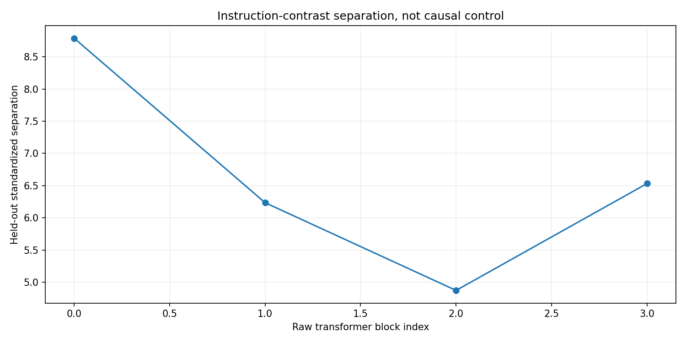
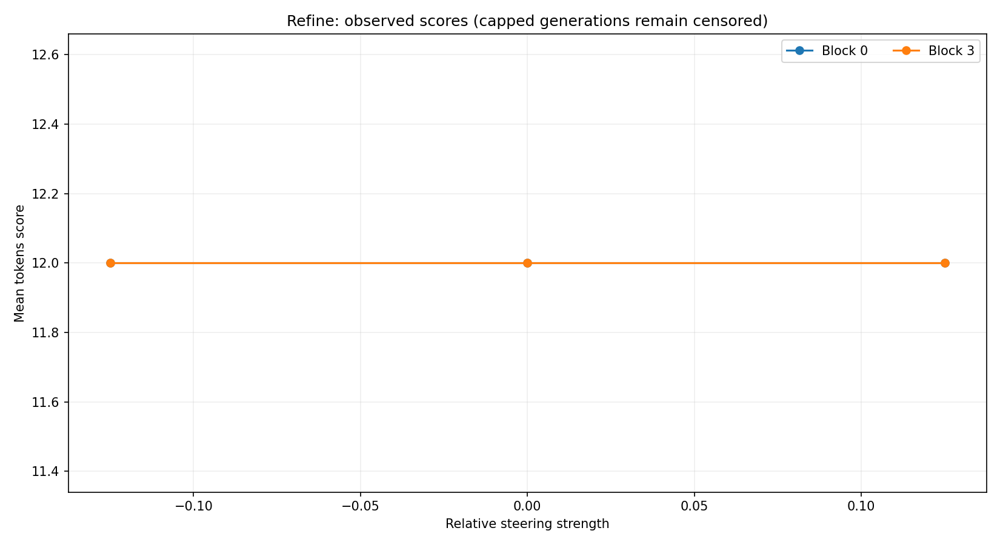
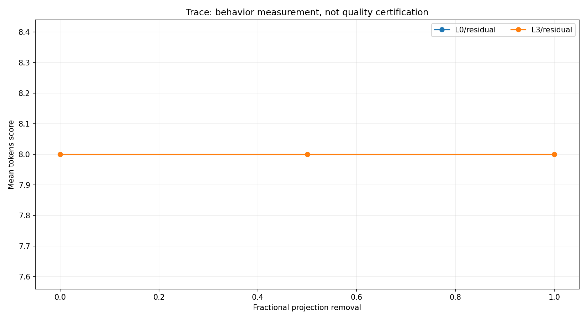
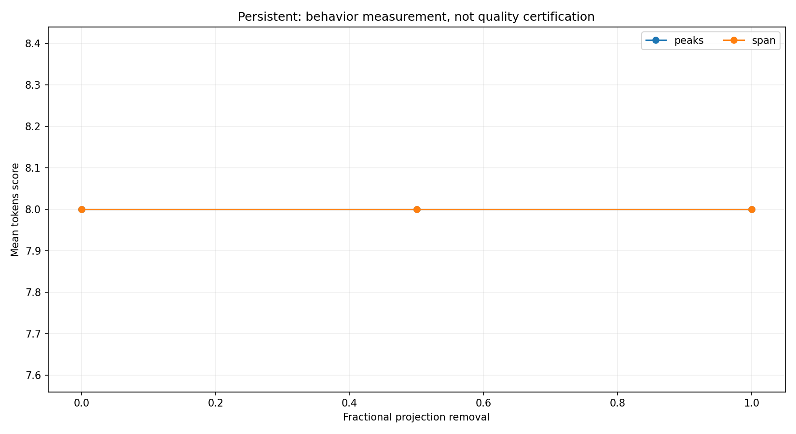
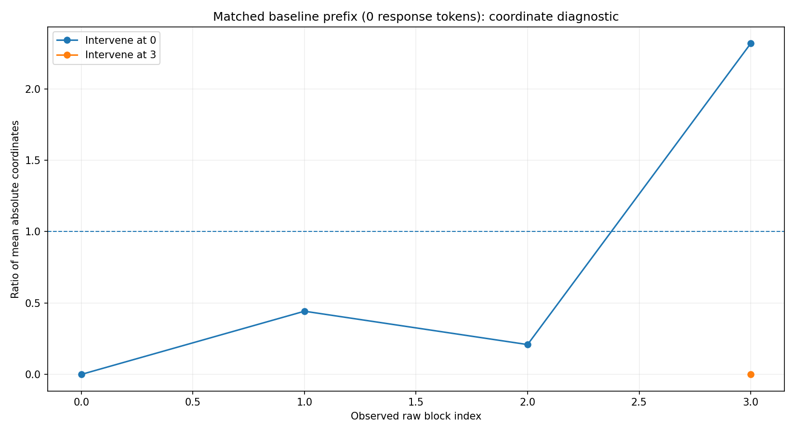
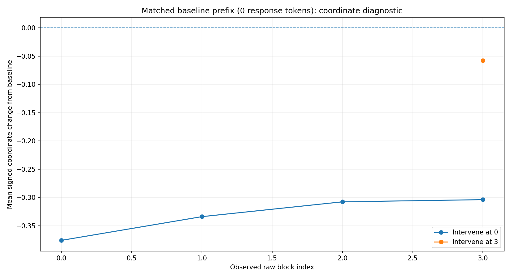
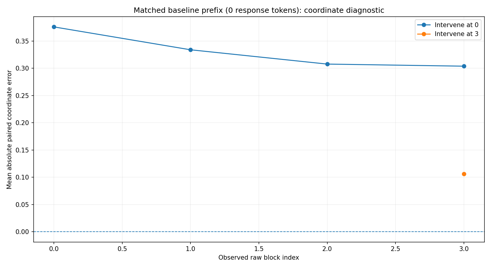
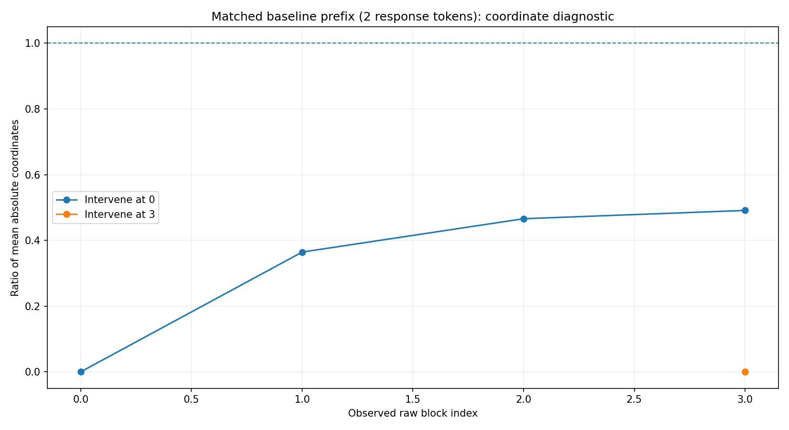
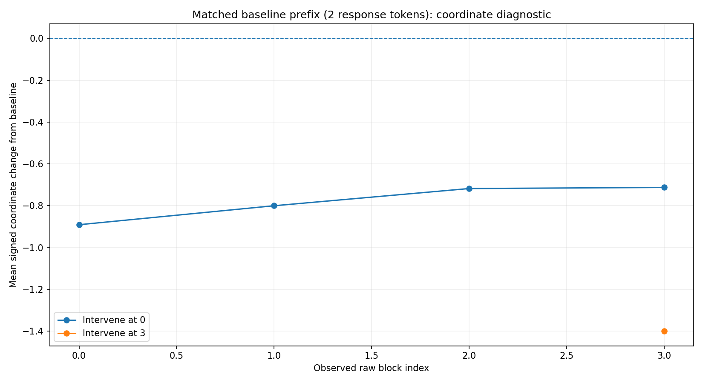
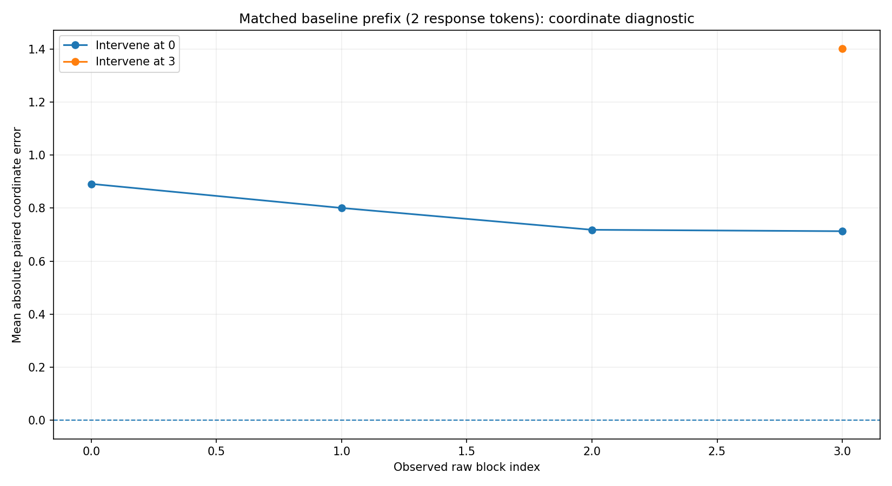

# AblationLab | verbosity

Model: `toy:moe`
Run: `moe`

**Next decision:** report
**Reason:** Experiments complete; report measured limits

Automatic research stages do not edit model parameters. A separate explicit export command writes a copied checkpoint.
Results describe this dataset, metric, precision, token scope, and model revision. They are not universal layer labels.

## Stage record

## Measurement plots













### inspect
What architecture and output sites were actually observed? Unsupported sites are not guessed.

```json
{
  "capabilities": {
    "device": "cpu",
    "dtype": "torch.float32",
    "expert_inventory": [
      {
        "layer": 0,
        "note": "inventory only; routed token outputs are not batch-aligned residual sites",
        "path": "model.layers.0.block_sparse_moe.experts",
        "type": "ModuleList"
      },
      {
        "layer": 0,
        "note": "inventory only; routed token outputs are not batch-aligned residual sites",
        "path": "model.layers.0.block_sparse_moe.experts.0.up_proj",
        "type": "Linear"
      },
      {
        "layer": 0,
        "note": "inventory only; routed token outputs are not batch-aligned residual sites",
        "path": "model.layers.0.block_sparse_moe.experts.0.gate_proj",
        "type": "Linear"
      },
      {
        "layer": 0,
        "note": "inventory only; routed token outputs are not batch-aligned residual sites",
        "path": "model.layers.0.block_sparse_moe.experts.0.down_proj",
        "type": "Linear"
      },
      {
        "layer": 0,
        "note": "inventory only; routed token outputs are not batch-aligned residual sites",
        "path": "model.layers.0.block_sparse_moe.experts.1.up_proj",
        "type": "Linear"
      },
      {
        "layer": 0,
        "note": "inventory only; routed token outputs are not batch-aligned residual sites",
        "path": "model.layers.0.block_sparse_moe.experts.1.gate_proj",
        "type": "Linear"
      },
      {
        "layer": 0,
        "note": "inventory only; routed token outputs are not batch-aligned residual sites",
        "path": "model.layers.0.block_sparse_moe.experts.1.down_proj",
        "type": "Linear"
      },
      {
        "layer": 0,
        "note": "inventory only; routed token outputs are not batch-aligned residual sites",
        "path": "model.layers.0.block_sparse_moe.experts.2.up_proj",
        "type": "Linear"
      },
      {
        "layer": 0,
        "note": "inventory only; routed token outputs are not batch-aligned residual sites",
        "path": "model.layers.0.block_sparse_moe.experts.2.gate_proj",
        "type": "Linear"
      },
      {
        "layer": 0,
        "note": "inventory only; routed token outputs are not batch-aligned residual sites",
        "path": "model.layers.0.block_sparse_moe.experts.2.down_proj",
        "type": "Linear"
      },
      {
        "layer": 1,
        "note": "inventory only; routed token outputs are not batch-aligned residual sites",
        "path": "model.layers.1.block_sparse_moe.experts",
        "type": "ModuleList"
      },
      {
        "layer": 1,
        "note": "inventory only; routed token outputs are not batch-aligned residual sites",
        "path": "model.layers.1.block_sparse_moe.experts.0.up_proj",
        "type": "Linear"
      },
      {
        "layer": 1,
        "note": "inventory only; routed token outputs are not batch-aligned residual sites",
        "path": "model.layers.1.block_sparse_moe.experts.0.gate_proj",
        "type": "Linear"
      },
      {
        "layer": 1,
        "note": "inventory only; routed token outputs are not batch-aligned residual sites",
        "path": "model.layers.1.block_sparse_moe.experts.0.down_proj",
        "type": "Linear"
      },
      {
        "layer": 1,
        "note": "inventory only; routed token outputs are not batch-aligned residual sites",
        "path": "model.layers.1.block_sparse_moe.experts.1.up_proj",
        "type": "Linear"
      },
      {
        "layer": 1,
        "note": "inventory only; routed token outputs are not batch-aligned residual sites",
        "path": "model.layers.1.block_sparse_moe.experts.1.gate_proj",
        "type": "Linear"
      },
      {
        "layer": 1,
        "note": "inventory only; routed token outputs are not batch-aligned residual sites",
        "path": "model.layers.1.block_sparse_moe.experts.1.down_proj",
        "type": "Linear"
      },
      {
        "layer": 1,
        "note": "inventory only; routed token outputs are not batch-aligned residual sites",
        "path": "model.layers.1.block_sparse_moe.experts.2.up_proj",
        "type": "Linear"
      },
      {
        "layer": 1,
        "note": "inventory only; routed token outputs are not batch-aligned residual sites",
        "path": "model.layers.1.block_sparse_moe.experts.2.gate_proj",
        "type": "Linear"
      },
      {
        "layer": 1,
        "note": "inventory only; routed token outputs are not batch-aligned residual sites",
        "path": "model.layers.1.block_sparse_moe.experts.2.down_proj",
        "type": "Linear"
      },
      {
        "layer": 2,
        "note": "inventory only; routed token outputs are not batch-aligned residual sites",
        "path": "model.layers.2.block_sparse_moe.experts",
        "type": "ModuleList"
      },
      {
        "layer": 2,
        "note": "inventory only; routed token outputs are not batch-aligned residual sites",
        "path": "model.layers.2.block_sparse_moe.experts.0.up_proj",
        "type": "Linear"
      },
      {
        "layer": 2,
        "note": "inventory only; routed token outputs are not batch-aligned residual sites",
        "path": "model.layers.2.block_sparse_moe.experts.0.gate_proj",
        "type": "Linear"
      },
      {
        "layer": 2,
        "note": "inventory only; routed token outputs are not batch-aligned residual sites",
        "path": "model.layers.2.block_sparse_moe.experts.0.down_proj",
        "type": "Linear"
      },
      {
        "layer": 2,
        "note": "inventory only; routed token outputs are not batch-aligned residual sites",
        "path": "model.layers.2.block_sparse_moe.experts.1.up_proj",
        "type": "Linear"
      },
      {
        "layer": 2,
        "note": "inventory only; routed token outputs are not batch-aligned residual sites",
        "path": "model.layers.2.block_sparse_moe.experts.1.gate_proj",
        "type": "Linear"
      },
      {
        "layer": 2,
        "note": "inventory only; routed token outputs are not batch-aligned residual sites",
        "path": "model.layers.2.block_sparse_moe.experts.1.down_proj",
        "type": "Linear"
      },
      {
        "layer": 2,
        "note": "inventory only; routed token outputs are not batch-aligned residual sites",
        "path": "model.layers.2.block_sparse_moe.experts.2.up_proj",
        "type": "Linear"
      },
      {
        "layer": 2,
        "note": "inventory only; routed token outputs are not batch-aligned residual sites",
        "path": "model.layers.2.block_sparse_moe.experts.2.gate_proj",
        "type": "Linear"
      },
      {
        "layer": 2,
        "note": "inventory only; routed token outputs are not batch-aligned residual sites",
        "path": "model.layers.2.block_sparse_moe.experts.2.down_proj",
        "type": "Linear"
      },
      {
        "layer": 3,
        "note": "inventory only; routed token outputs are not batch-aligned residual sites",
        "path": "model.layers.3.block_sparse_moe.experts",
        "type": "ModuleList"
      },
      {
        "layer": 3,
        "note": "inventory only; routed token outputs are not batch-aligned residual sites",
        "path": "model.layers.3.block_sparse_moe.experts.0.up_proj",
        "type": "Linear"
      },
      {
        "layer": 3,
        "note": "inventory only; routed token outputs are not batch-aligned residual sites",
        "path": "model.layers.3.block_sparse_moe.experts.0.gate_proj",
        "type": "Linear"
      },
      {
        "layer": 3,
        "note": "inventory only; routed token outputs are not batch-aligned residual sites",
        "path": "model.layers.3.block_sparse_moe.experts.0.down_proj",
        "type": "Linear"
      },
      {
        "layer": 3,
        "note": "inventory only; routed token outputs are not batch-aligned residual sites",
        "path": "model.layers.3.block_sparse_moe.experts.1.up_proj",
        "type": "Linear"
      },
      {
        "layer": 3,
        "note": "inventory only; routed token outputs are not batch-aligned residual sites",
        "path": "model.layers.3.block_sparse_moe.experts.1.gate_proj",
        "type": "Linear"
      },
      {
        "layer": 3,
        "note": "inventory only; routed token outputs are not batch-aligned residual sites",
        "path": "model.layers.3.block_sparse_moe.experts.1.down_proj",
        "type": "Linear"
      },
      {
        "layer": 3,
        "note": "inventory only; routed token outputs are not batch-aligned residual sites",
        "path": "model.layers.3.block_sparse_moe.experts.2.up_proj",
        "type": "Linear"
      },
      {
        "layer": 3,
        "note": "inventory only; routed token outputs are not batch-aligned residual sites",
        "path": "model.layers.3.block_sparse_moe.experts.2.gate_proj",
        "type": "Linear"
      },
      {
        "layer": 3,
        "note": "inventory only; routed token outputs are not batch-aligned residual sites",
        "path": "model.layers.3.block_sparse_moe.experts.2.down_proj",
        "type": "Linear"
      }
    ],
    "hidden_size": 24,
    "limitations": [
      "MoE support refers to block/aggregate-mixture output, not arbitrary routed/fused expert surgery",
      "Names and output shapes do not prove a component's natural behavioral role",
      "last-block hooks are before final model norm; directions use that same site"
    ],
    "model_id": "toy:moe",
    "moe_layers": [
      0,
      1,
      2,
      3
    ],
    "num_layers": 4,
    "parameter_bytes": 256896,
    "parameter_count": 64224,
    "resolved_revision": null,
    "sites": [
      {
        "exportable_linear": false,
        "kind": "residual",
        "layer": 0,
        "name": "residual",
        "path": "model.layers.0",
        "runtime_validated": true
      },
      {
        "exportable_linear": true,
        "kind": "writer",
        "layer": 0,
        "name": "attention",
        "path": "model.layers.0.self_attn.o_proj",
        "runtime_validated": true
      },
      {
        "exportable_linear": false,
        "kind": "aggregate",
        "layer": 0,
        "name": "mlp",
        "path": "model.layers.0.block_sparse_moe",
        "runtime_validated": true
      },
      {
        "exportable_linear": false,
        "kind": "residual",
        "layer": 1,
        "name": "residual",
        "path": "model.layers.1",
        "runtime_validated": true
      },
      {
        "exportable_linear": true,
        "kind": "writer",
        "layer": 1,
        "name": "attention",
        "path": "model.layers.1.self_attn.o_proj",
        "runtime_validated": true
      },
      {
        "exportable_linear": false,
        "kind": "aggregate",
        "layer": 1,
        "name": "mlp",
        "path": "model.layers.1.block_sparse_moe",
        "runtime_validated": true
      },
      {
        "exportable_linear": false,
        "kind": "residual",
        "layer": 2,
        "name": "residual",
        "path": "model.layers.2",
        "runtime_validated": true
      },
      {
        "exportable_linear": true,
        "kind": "writer",
        "layer": 2,
        "name": "attention",
        "path": "model.layers.2.self_attn.o_proj",
        "runtime_validated": true
      },
      {
        "exportable_linear": false,
        "kind": "aggregate",
        "layer": 2,
        "name": "mlp",
        "path": "model.layers.2.block_sparse_moe",
        "runtime_validated": true
      },
      {
        "exportable_linear": false,
        "kind": "residual",
        "layer": 3,
        "name": "residual",
        "path": "model.layers.3",
        "runtime_validated": true
      },
      {
        "exportable_linear": true,
        "kind": "writer",
        "layer": 3,
        "name": "attention",
        "path": "model.layers.3.self_attn.o_proj",
        "runtime_validated": true
      },
      {
        "exportable_linear": false,
        "kind": "aggregate",
        "layer": 3,
        "name": "mlp",
        "path": "model.layers.3.block_sparse_moe",
        "runtime_validated": true
      }
    ],
    "stack_path": "model.layers",
    "toy_fixture": true
  },
  "model_identity": "00d8035ec4a3db5d57437ec51a0987395124b6361656cbcb2e193bcc42243190"
}
```

### baseline
How does the untouched model respond? The positive/negative instructions may not produce the behavior you expected.

```json
{
  "cap_rate": 1.0,
  "mean_score": 8.0,
  "no_op_exact": true,
  "note": "Instruction labels do not prove observed behavior; inspect contrast_outputs.json",
  "positive_minus_negative_score": 0.0
}
```

### capture
Capture raw block outputs on paired training/validation examples, before final model normalization.

```json
{
  "capture_site": "raw_block_output",
  "ids": {
    "train": [
      "train-0",
      "train-1",
      "train-2",
      "train-3"
    ],
    "validation": [
      "validation-0",
      "validation-1",
      "validation-2",
      "validation-3"
    ]
  },
  "model_identity": "00d8035ec4a3db5d57437ec51a0987395124b6361656cbcb2e193bcc42243190",
  "position": "last_prompt_token",
  "shapes": {
    "train_negative": [
      4,
      4,
      24
    ],
    "train_positive": [
      4,
      4,
      24
    ],
    "validation_negative": [
      4,
      4,
      24
    ],
    "validation_positive": [
      4,
      4,
      24
    ]
  }
}
```

### directions
Estimate a direction or subspace and check held-out separation. This is not proof of causality.

```json
{
  "calibrated": true,
  "eligible_layers": [
    0,
    1,
    2,
    3
  ],
  "metrics": [
    {
      "layer": 0,
      "midpoint_accuracy": 0.875,
      "negative_coordinate": 0.10054752230644226,
      "paired_positive_fraction": 1.0,
      "pooled_std": 0.0325576476752758,
      "positive_coordinate": 0.3834195137023926,
      "standardized_separation": 8.7874963084809,
      "train_gap": 0.28287196159362793,
      "validation_margin": 0.28610020875930786
    },
    {
      "layer": 1,
      "midpoint_accuracy": 1.0,
      "negative_coordinate": 0.3260110020637512,
      "paired_positive_fraction": 1.0,
      "pooled_std": 0.05657610297203064,
      "positive_coordinate": 0.6762906312942505,
      "standardized_separation": 6.234947816005128,
      "train_gap": 0.35027968883514404,
      "validation_margin": 0.3527490496635437
    },
    {
      "layer": 2,
      "midpoint_accuracy": 1.0,
      "negative_coordinate": 0.00785645842552185,
      "paired_positive_fraction": 1.0,
      "pooled_std": 0.08153816312551498,
      "positive_coordinate": 0.4102347195148468,
      "standardized_separation": 4.873714565427376,
      "train_gap": 0.4023783504962921,
      "validation_margin": 0.39739373326301575
    },
    {
      "layer": 3,
      "midpoint_accuracy": 1.0,
      "negative_coordinate": -0.2622961699962616,
      "paired_positive_fraction": 1.0,
      "pooled_std": 0.0694042444229126,
      "positive_coordinate": 0.1968550682067871,
      "standardized_separation": 6.532134729176149,
      "train_gap": 0.45915132761001587,
      "validation_margin": 0.45335787534713745
    }
  ],
  "note": "Held-out instruction-contrast separation; not automatic causal proof"
}
```

### sweep
Intervene at individual layers and compare behavioral scores. Random directions test generic disruption.

```json
{
  "candidates": [],
  "cap_heavy": false,
  "exploratory_candidates": [
    {
      "cap_rate": 1.0,
      "effect": 0.0,
      "effect_fraction": 0.0,
      "eligible": false,
      "layer": 0,
      "max_new_tokens": 8,
      "orientation": 1,
      "random_control_max_effect": 0.0,
      "ranking_score": 0.0,
      "repeat_increase": 0.0,
      "signed_effect": 0.0,
      "specificity_pass": false,
      "strength_score_correlation": 0.0,
      "win_rate": 0.0
    },
    {
      "cap_rate": 1.0,
      "effect": 0.0,
      "effect_fraction": 0.0,
      "eligible": false,
      "layer": 3,
      "max_new_tokens": 8,
      "orientation": 1,
      "random_control_max_effect": 0.0,
      "ranking_score": 0.0,
      "repeat_increase": 0.0,
      "signed_effect": 0.0,
      "specificity_pass": false,
      "strength_score_correlation": 0.0,
      "win_rate": 0.0
    }
  ],
  "max_new_tokens": 8,
  "note": "Candidate thresholds are configurable heuristics; test split not used here",
  "strengths": [
    -0.25,
    0.25
  ],
  "summary": [
    {
      "cap_rate": 1.0,
      "effect": 0.0,
      "effect_fraction": 0.0,
      "eligible": false,
      "layer": 0,
      "max_new_tokens": 8,
      "orientation": 1,
      "random_control_max_effect": 0.0,
      "ranking_score": 0.0,
      "repeat_increase": 0.0,
      "signed_effect": 0.0,
      "specificity_pass": false,
      "strength_score_correlation": 0.0,
      "win_rate": 0.0
    },
    {
      "cap_rate": 1.0,
      "effect": 0.0,
      "effect_fraction": 0.0,
      "eligible": false,
      "layer": 3,
      "max_new_tokens": 8,
      "orientation": 1,
      "random_control_max_effect": 0.0,
      "ranking_score": 0.0,
      "repeat_increase": 0.0,
      "signed_effect": 0.0,
      "specificity_pass": false,
      "strength_score_correlation": 0.0,
      "win_rate": 0.0
    }
  ]
}
```

### refine
One bounded confirmation with gentler interventions and a higher token ceiling.

```json
{
  "candidates": [],
  "cap_heavy": false,
  "exploratory_candidates": [
    {
      "cap_rate": 1.0,
      "effect": 0.0,
      "effect_fraction": 0.0,
      "eligible": false,
      "layer": 0,
      "max_new_tokens": 12,
      "orientation": 1,
      "random_control_max_effect": 0.0,
      "ranking_score": 0.0,
      "repeat_increase": 0.0,
      "signed_effect": 0.0,
      "specificity_pass": false,
      "strength_score_correlation": 0.0,
      "win_rate": 0.0
    },
    {
      "cap_rate": 1.0,
      "effect": 0.0,
      "effect_fraction": 0.0,
      "eligible": false,
      "layer": 3,
      "max_new_tokens": 12,
      "orientation": 1,
      "random_control_max_effect": 0.0,
      "ranking_score": 0.0,
      "repeat_increase": 0.0,
      "signed_effect": 0.0,
      "specificity_pass": false,
      "strength_score_correlation": 0.0,
      "win_rate": 0.0
    }
  ],
  "max_new_tokens": 12,
  "note": "Candidate thresholds are configurable heuristics; test split not used here",
  "strengths": [
    -0.125,
    0.125
  ],
  "summary": [
    {
      "cap_rate": 1.0,
      "effect": 0.0,
      "effect_fraction": 0.0,
      "eligible": false,
      "layer": 0,
      "max_new_tokens": 12,
      "orientation": 1,
      "random_control_max_effect": 0.0,
      "ranking_score": 0.0,
      "repeat_increase": 0.0,
      "signed_effect": 0.0,
      "specificity_pass": false,
      "strength_score_correlation": 0.0,
      "win_rate": 0.0
    },
    {
      "cap_rate": 1.0,
      "effect": 0.0,
      "effect_fraction": 0.0,
      "eligible": false,
      "layer": 3,
      "max_new_tokens": 12,
      "orientation": 1,
      "random_control_max_effect": 0.0,
      "ranking_score": 0.0,
      "repeat_increase": 0.0,
      "signed_effect": 0.0,
      "specificity_pass": false,
      "strength_score_correlation": 0.0,
      "win_rate": 0.0
    }
  ]
}
```

### writers
Compare places to inject an activation. This does not identify which matrix naturally owns the behavior.

```json
{
  "note": "For sequential pre-norm blocks, MLP-output addition and block-output addition can be algebraically equivalent; rounding is not natural attribution",
  "selected_sites": [],
  "summary": [
    {
      "cap_rate": 1.0,
      "effect": 0.0,
      "kind": "residual",
      "layer": 0,
      "note": "Intervention-site sensitivity, NOT natural component responsibility",
      "path": "model.layers.0",
      "site": "residual",
      "win_rate": 0.0
    },
    {
      "cap_rate": 1.0,
      "effect": 0.0,
      "kind": "writer",
      "layer": 0,
      "note": "Intervention-site sensitivity, NOT natural component responsibility",
      "path": "model.layers.0.self_attn.o_proj",
      "site": "attention",
      "win_rate": 0.0
    },
    {
      "cap_rate": 1.0,
      "effect": 0.0,
      "kind": "aggregate",
      "layer": 0,
      "note": "Intervention-site sensitivity, NOT natural component responsibility",
      "path": "model.layers.0.block_sparse_moe",
      "site": "mlp",
      "win_rate": 0.0
    },
    {
      "cap_rate": 1.0,
      "effect": 0.0,
      "kind": "composite",
      "layer": 0,
      "note": "Intervention-site sensitivity, NOT natural component responsibility",
      "path": "split attention + MLP output injection",
      "site": "both",
      "win_rate": 0.0
    },
    {
      "cap_rate": 1.0,
      "effect": 0.0,
      "kind": "residual",
      "layer": 3,
      "note": "Intervention-site sensitivity, NOT natural component responsibility",
      "path": "model.layers.3",
      "site": "residual",
      "win_rate": 0.0
    },
    {
      "cap_rate": 1.0,
      "effect": 0.0,
      "kind": "writer",
      "layer": 3,
      "note": "Intervention-site sensitivity, NOT natural component responsibility",
      "path": "model.layers.3.self_attn.o_proj",
      "site": "attention",
      "win_rate": 0.0
    },
    {
      "cap_rate": 1.0,
      "effect": 0.0,
      "kind": "aggregate",
      "layer": 3,
      "note": "Intervention-site sensitivity, NOT natural component responsibility",
      "path": "model.layers.3.block_sparse_moe",
      "site": "mlp",
      "win_rate": 0.0
    },
    {
      "cap_rate": 1.0,
      "effect": 0.0,
      "kind": "composite",
      "layer": 3,
      "note": "Intervention-site sensitivity, NOT natural component responsibility",
      "path": "split attention + MLP output injection",
      "site": "both",
      "win_rate": 0.0
    }
  ]
}
```

### ablate
Remove an existing component at writer outputs. Zero and negative-class coordinates are not equivalent.

```json
{
  "all_tested": 0,
  "note": "Zero removes a geometric component, not necessarily positive behavior; negative-centroid reference is separately declared",
  "promising": [],
  "summary": []
}
```

### trace
Compare raw residual ablation with fixed-prefix, signed-coordinate measurements. Coordinate return alone is not reconstruction.

```json
{
  "all_tested": 4,
  "note": "Zero removes a geometric component, not necessarily positive behavior; negative-centroid reference is separately declared",
  "projection_summary": [
    {
      "eligible_fraction": 1.0,
      "mean_abs_paired_error": 0.375799217261374,
      "mean_baseline_abs": 0.375799223780632,
      "mean_baseline_signed": 0.375799223780632,
      "mean_changed_abs": 2.8870999813079834e-08,
      "mean_changed_signed": 6.51925802230835e-09,
      "mean_signed_delta": -0.375799217261374,
      "median_individual_abs_ratio_eligible": 6.553359095150986e-08,
      "observed_layer": 0,
      "prefix_tokens": 0,
      "ratio_of_mean_abs": 7.682559725012341e-08,
      "rmse_paired": 0.37820205536227025,
      "sign_agreement_eligible": 0.75,
      "source_layer": 0
    },
    {
      "eligible_fraction": 1.0,
      "mean_abs_paired_error": 0.3338291645050049,
      "mean_baseline_abs": 0.5987603664398193,
      "mean_baseline_signed": 0.5987603664398193,
      "mean_changed_abs": 0.26493120193481445,
      "mean_changed_signed": 0.26493120193481445,
      "mean_signed_delta": -0.3338291645050049,
      "median_individual_abs_ratio_eligible": 0.41612906446901016,
      "observed_layer": 1,
      "prefix_tokens": 0,
      "ratio_of_mean_abs": 0.4424661630663264,
      "rmse_paired": 0.33596488585280465,
      "sign_agreement_eligible": 1.0,
      "source_layer": 0
    },
    {
      "eligible_fraction": 1.0,
      "mean_abs_paired_error": 0.3076146710664034,
      "mean_baseline_abs": 0.34820856153964996,
      "mean_baseline_signed": 0.34820856153964996,
      "mean_changed_abs": 0.07271040044724941,
      "mean_changed_signed": 0.040593890473246574,
      "mean_signed_delta": -0.3076146710664034,
      "median_individual_abs_ratio_eligible": 0.164840111305618,
      "observed_layer": 2,
      "prefix_tokens": 0,
      "ratio_of_mean_abs": 0.2088127877320156,
      "rmse_paired": 0.30953765916115017,
      "sign_agreement_eligible": 0.5,
      "source_layer": 0
    },
    {
      "eligible_fraction": 0.5,
      "mean_abs_paired_error": 0.3037570398300886,
      "mean_baseline_abs": 0.10610130988061428,
      "mean_baseline_signed": 0.05789545737206936,
      "mean_changed_abs": 0.24586158245801926,
      "mean_changed_signed": -0.24586158245801926,
      "mean_signed_delta": -0.3037570398300886,
      "median_individual_abs_ratio_eligible": 1.060554461734661,
      "observed_layer": 3,
      "prefix_tokens": 0,
      "ratio_of_mean_abs": 2.3172341862194155,
      "rmse_paired": 0.30578672714750055,
      "sign_agreement_eligible": 0.0,
      "source_layer": 0
    },
    {
      "eligible_fraction": 1.0,
      "mean_abs_paired_error": 0.8911534212529659,
      "mean_baseline_abs": 0.8911533951759338,
      "mean_baseline_signed": 0.8911533951759338,
      "mean_changed_abs": 8.195638656616211e-08,
      "mean_changed_signed": -2.60770320892334e-08,
      "mean_signed_delta": -0.8911534212529659,
      "median_individual_abs_ratio_eligible": 9.704926391935345e-08,
      "observed_layer": 0,
      "prefix_tokens": 2,
      "ratio_of_mean_abs": 9.196664346431859e-08,
      "rmse_paired": 0.8939010273870233,
      "sign_agreement_eligible": 0.25,
      "source_layer": 0
    },
    {
      "eligible_fraction": 1.0,
      "mean_abs_paired_error": 0.8003726229071617,
      "mean_baseline_abs": 1.2591645419597626,
      "mean_baseline_signed": 1.2591645419597626,
      "mean_changed_abs": 0.45879191905260086,
      "mean_changed_signed": 0.45879191905260086,
      "mean_signed_delta": -0.8003726229071617,
      "median_individual_abs_ratio_eligible": 0.35550857069872444,
      "observed_layer": 1,
      "prefix_tokens": 2,
      "ratio_of_mean_abs": 0.3643621653596896,
      "rmse_paired": 0.8014106882632891,
      "sign_agreement_eligible": 1.0,
      "source_layer": 0
    },
    {
      "eligible_fraction": 1.0,
      "mean_abs_paired_error": 0.718075592070818,
      "mean_baseline_abs": 1.0468599200248718,
      "mean_baseline_signed": 1.0468599200248718,
      "mean_changed_abs": 0.48767291381955147,
      "mean_changed_signed": 0.3287843279540539,
      "mean_signed_delta": -0.718075592070818,
      "median_individual_abs_ratio_eligible": 0.49024008362180405,
      "observed_layer": 2,
      "prefix_tokens": 2,
      "ratio_of_mean_abs": 0.46584352356136155,
      "rmse_paired": 0.7184631623865764,
      "sign_agreement_eligible": 0.5,
      "source_layer": 0
    },
    {
      "eligible_fraction": 1.0,
      "mean_abs_paired_error": 0.712767519056797,
      "mean_baseline_abs": 1.400507390499115,
      "mean_baseline_signed": 1.400507390499115,
      "mean_changed_abs": 0.687739871442318,
      "mean_changed_signed": 0.687739871442318,
      "mean_signed_delta": -0.712767519056797,
      "median_individual_abs_ratio_eligible": 0.4908472052210285,
      "observed_layer": 3,
      "prefix_tokens": 2,
      "ratio_of_mean_abs": 0.49106479273716663,
      "rmse_paired": 0.7129977217359108,
      "sign_agreement_eligible": 1.0,
      "source_layer": 0
    },
    {
      "eligible_fraction": 0.5,
      "mean_abs_paired_error": 0.10610132943838835,
      "mean_baseline_abs": 0.10610130988061428,
      "mean_baseline_signed": 0.05789545737206936,
      "mean_changed_abs": 6.05359673500061e-08,
      "mean_changed_signed": -1.210719347000122e-08,
      "mean_signed_delta": -0.05789546947926283,
      "median_individual_abs_ratio_eligible": 5.268600353096524e-07,
      "observed_layer": 3,
      "prefix_tokens": 0,
      "ratio_of_mean_abs": 5.705487276087494e-07,
      "rmse_paired": 0.11329744836074758,
      "sign_agreement_eligible": 0.5,
      "source_layer": 3
    },
    {
      "eligible_fraction": 1.0,
      "mean_abs_paired_error": 1.4005073024891317,
      "mean_baseline_abs": 1.400507390499115,
      "mean_baseline_signed": 1.400507390499115,
      "mean_changed_abs": 1.5506520867347717e-07,
      "mean_changed_signed": 8.800998330116272e-08,
      "mean_signed_delta": -1.4005073024891317,
      "median_individual_abs_ratio_eligible": 1.322046506672191e-07,
      "observed_layer": 3,
      "prefix_tokens": 2,
      "ratio_of_mean_abs": 1.1072073573150857e-07,
      "rmse_paired": 1.412388635462136,
      "sign_agreement_eligible": 0.5,
      "source_layer": 3
    }
  ],
  "promising": [],
  "summary": [
    {
      "baseline_cap_rate": 1.0,
      "cap_rate": 1.0,
      "ci95_high": 0.0,
      "ci95_low": 0.0,
      "gain_fraction_of_baseline_mean": 0.0,
      "intervention": {
        "control_seed": null,
        "layers": [
          0
        ],
        "operation": "ablate",
        "phase": "both",
        "reference": "zero",
        "scope": "last",
        "site": "residual",
        "strength": 0.5
      },
      "label": "L0/residual",
      "mean_baseline": 8.0,
      "mean_gain": 0.0,
      "mean_intervention": 8.0,
      "mean_per_example_fraction": 0.0,
      "median_gain": 0.0,
      "n": 4,
      "provisional_pass": false,
      "random_control_max_gain_fraction": 0.0,
      "repeat_increase": 0.0,
      "required_term_change": null,
      "tie_rate": 1.0,
      "uncensored_pair_fraction": 0.0,
      "win_rate": 0.0
    },
    {
      "baseline_cap_rate": 1.0,
      "cap_rate": 1.0,
      "ci95_high": 0.0,
      "ci95_low": 0.0,
      "gain_fraction_of_baseline_mean": 0.0,
      "intervention": {
        "control_seed": null,
        "layers": [
          0
        ],
        "operation": "ablate",
        "phase": "both",
        "reference": "zero",
        "scope": "last",
        "site": "residual",
        "strength": 1.0
      },
      "label": "L0/residual",
      "mean_baseline": 8.0,
      "mean_gain": 0.0,
      "mean_intervention": 8.0,
      "mean_per_example_fraction": 0.0,
      "median_gain": 0.0,
      "n": 4,
      "provisional_pass": false,
      "random_control_max_gain_fraction": 0.0,
      "repeat_increase": 0.0,
      "required_term_change": null,
      "tie_rate": 1.0,
      "uncensored_pair_fraction": 0.0,
      "win_rate": 0.0
    },
    {
      "baseline_cap_rate": 1.0,
      "cap_rate": 1.0,
      "ci95_high": 0.0,
      "ci95_low": 0.0,
      "gain_fraction_of_baseline_mean": 0.0,
      "intervention": {
        "control_seed": null,
        "layers": [
          3
        ],
        "operation": "ablate",
        "phase": "both",
        "reference": "zero",
        "scope": "last",
        "site": "residual",
        "strength": 0.5
      },
      "label": "L3/residual",
      "mean_baseline": 8.0,
      "mean_gain": 0.0,
      "mean_intervention": 8.0,
      "mean_per_example_fraction": 0.0,
      "median_gain": 0.0,
      "n": 4,
      "provisional_pass": false,
      "random_control_max_gain_fraction": 0.0,
      "repeat_increase": 0.0,
      "required_term_change": null,
      "tie_rate": 1.0,
      "uncensored_pair_fraction": 0.0,
      "win_rate": 0.0
    },
    {
      "baseline_cap_rate": 1.0,
      "cap_rate": 1.0,
      "ci95_high": 0.0,
      "ci95_low": 0.0,
      "gain_fraction_of_baseline_mean": 0.0,
      "intervention": {
        "control_seed": null,
        "layers": [
          3
        ],
        "operation": "ablate",
        "phase": "both",
        "reference": "zero",
        "scope": "last",
        "site": "residual",
        "strength": 1.0
      },
      "label": "L3/residual",
      "mean_baseline": 8.0,
      "mean_gain": 0.0,
      "mean_intervention": 8.0,
      "mean_per_example_fraction": 0.0,
      "median_gain": 0.0,
      "n": 4,
      "provisional_pass": false,
      "random_control_max_gain_fraction": 0.0,
      "repeat_increase": 0.0,
      "required_term_change": null,
      "tie_rate": 1.0,
      "uncensored_pair_fraction": 0.0,
      "win_rate": 0.0
    }
  ],
  "trace_caveat": "Matched fixed-prefix, single-forward diagnostic. Later layer probes use different directions; coordinate return is not proof of information reconstruction. Not a recording of divergent autoregressive generations."
}
```

### persistent
Repeat a defined intervention over selected layers. Compare a matched random projection, not just raw output length.

```json
{
  "all_tested": 4,
  "note": "Each layer uses its own calibrated basis. More layers means larger total intervention; random controls are matched to the same region. No automatic expansion beyond configured regions.",
  "promising": [],
  "regions": {
    "peaks": [
      0,
      3
    ],
    "span": [
      0,
      1,
      2,
      3
    ]
  },
  "summary": [
    {
      "baseline_cap_rate": 1.0,
      "cap_rate": 1.0,
      "ci95_high": 0.0,
      "ci95_low": 0.0,
      "gain_fraction_of_baseline_mean": 0.0,
      "intervention": {
        "control_seed": null,
        "layers": [
          0,
          3
        ],
        "operation": "ablate",
        "phase": "both",
        "reference": "zero",
        "scope": "last",
        "site": "residual",
        "strength": 0.5
      },
      "label": "peaks",
      "mean_baseline": 8.0,
      "mean_gain": 0.0,
      "mean_intervention": 8.0,
      "mean_per_example_fraction": 0.0,
      "median_gain": 0.0,
      "n": 4,
      "provisional_pass": false,
      "random_control_max_gain_fraction": 0.0,
      "repeat_increase": 0.0,
      "required_term_change": null,
      "tie_rate": 1.0,
      "uncensored_pair_fraction": 0.0,
      "win_rate": 0.0
    },
    {
      "baseline_cap_rate": 1.0,
      "cap_rate": 1.0,
      "ci95_high": 0.0,
      "ci95_low": 0.0,
      "gain_fraction_of_baseline_mean": 0.0,
      "intervention": {
        "control_seed": null,
        "layers": [
          0,
          3
        ],
        "operation": "ablate",
        "phase": "both",
        "reference": "zero",
        "scope": "last",
        "site": "residual",
        "strength": 1.0
      },
      "label": "peaks",
      "mean_baseline": 8.0,
      "mean_gain": 0.0,
      "mean_intervention": 8.0,
      "mean_per_example_fraction": 0.0,
      "median_gain": 0.0,
      "n": 4,
      "provisional_pass": false,
      "random_control_max_gain_fraction": 0.0,
      "repeat_increase": 0.0,
      "required_term_change": null,
      "tie_rate": 1.0,
      "uncensored_pair_fraction": 0.0,
      "win_rate": 0.0
    },
    {
      "baseline_cap_rate": 1.0,
      "cap_rate": 1.0,
      "ci95_high": 0.0,
      "ci95_low": 0.0,
      "gain_fraction_of_baseline_mean": 0.0,
      "intervention": {
        "control_seed": null,
        "layers": [
          0,
          1,
          2,
          3
        ],
        "operation": "ablate",
        "phase": "both",
        "reference": "zero",
        "scope": "last",
        "site": "residual",
        "strength": 0.5
      },
      "label": "span",
      "mean_baseline": 8.0,
      "mean_gain": 0.0,
      "mean_intervention": 8.0,
      "mean_per_example_fraction": 0.0,
      "median_gain": 0.0,
      "n": 4,
      "provisional_pass": false,
      "random_control_max_gain_fraction": 0.0,
      "repeat_increase": 0.0,
      "required_term_change": null,
      "tie_rate": 1.0,
      "uncensored_pair_fraction": 0.0,
      "win_rate": 0.0
    },
    {
      "baseline_cap_rate": 1.0,
      "cap_rate": 1.0,
      "ci95_high": 0.0,
      "ci95_low": 0.0,
      "gain_fraction_of_baseline_mean": 0.0,
      "intervention": {
        "control_seed": null,
        "layers": [
          0,
          1,
          2,
          3
        ],
        "operation": "ablate",
        "phase": "both",
        "reference": "zero",
        "scope": "last",
        "site": "residual",
        "strength": 1.0
      },
      "label": "span",
      "mean_baseline": 8.0,
      "mean_gain": 0.0,
      "mean_intervention": 8.0,
      "mean_per_example_fraction": 0.0,
      "median_gain": 0.0,
      "n": 4,
      "provisional_pass": false,
      "random_control_max_gain_fraction": 0.0,
      "repeat_increase": 0.0,
      "required_term_change": null,
      "tie_rate": 1.0,
      "uncensored_pair_fraction": 0.0,
      "win_rate": 0.0
    }
  ]
}
```

### evaluate
Apply the chosen intervention to held-out test/control examples. Lexical checks are not factual verification.

```json
{
  "control": {
    "baseline_cap_rate": 1.0,
    "cap_rate": 1.0,
    "ci95_high": 0.0,
    "ci95_low": 0.0,
    "gain_fraction_of_baseline_mean": 0.0,
    "intervention": {
      "control_seed": null,
      "layers": [
        0
      ],
      "operation": "steer",
      "phase": "both",
      "reference": "zero",
      "scope": "last",
      "site": "residual",
      "strength": -0.25
    },
    "mean_baseline": 8.0,
    "mean_gain": 0.0,
    "mean_intervention": 8.0,
    "mean_per_example_fraction": 0.0,
    "median_gain": 0.0,
    "n": 1,
    "provisional_pass": false,
    "repeat_increase": 0.0,
    "required_term_change": null,
    "tie_rate": 1.0,
    "uncensored_pair_fraction": 0.0,
    "win_rate": 0.0
  },
  "control_absolute_drift_fraction": 0.0,
  "control_reference_nll_increase": 0.00881338119506836,
  "needs_human_quality_review": true,
  "note": "Lexical/repetition checks do not establish factual accuracy, and a small held-out set does not establish general performance",
  "passed": false,
  "selected_intervention": {
    "control_seed": null,
    "layers": [
      0
    ],
    "operation": "steer",
    "phase": "both",
    "reference": "zero",
    "scope": "last",
    "site": "residual",
    "strength": -0.25
  },
  "test": {
    "baseline_cap_rate": 1.0,
    "cap_rate": 1.0,
    "ci95_high": 0.0,
    "ci95_low": 0.0,
    "gain_fraction_of_baseline_mean": 0.0,
    "intervention": {
      "control_seed": null,
      "layers": [
        0
      ],
      "operation": "steer",
      "phase": "both",
      "reference": "zero",
      "scope": "last",
      "site": "residual",
      "strength": -0.25
    },
    "mean_baseline": 8.0,
    "mean_gain": 0.0,
    "mean_intervention": 8.0,
    "mean_per_example_fraction": 0.0,
    "median_gain": 0.0,
    "n": 2,
    "provisional_pass": false,
    "repeat_increase": 0.0,
    "required_term_change": null,
    "tie_rate": 1.0,
    "uncensored_pair_fraction": 0.0,
    "win_rate": 0.0
  }
}
```

## Interpretation limits

A larger raw activation margin is not automatically better separability; use standardized held-out metrics.
Signed deltas and paired errors matter. Ratios with small denominators are unstable.
Generation limits censor lengths. Mean per-example percentages and ratios of means are different statistics.
No-op/cache checks test software plumbing, not semantic quality. Random directions are controls, not guaranteed inert features.
A selected winner can fail held-out/control evaluation. No export is triggered by candidate rank alone.
